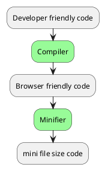

# Note
From Development to Production environment, our application code needs to be compiled, bundled, minified, and code split.

## Compiling
Flow: Developer friendly ==>Compile==>Browser friendly

NextJs will compile code when you are edit the code during development stage.

## Minifying
Theory: Remove unnecessary code formatting and comments without changing the code’s functionality. The goal is to improve the application’s performance by decreasing file sizes.
Time: In Next.js, JavaScript and CSS files are automatically minified for production.

# Bundle

